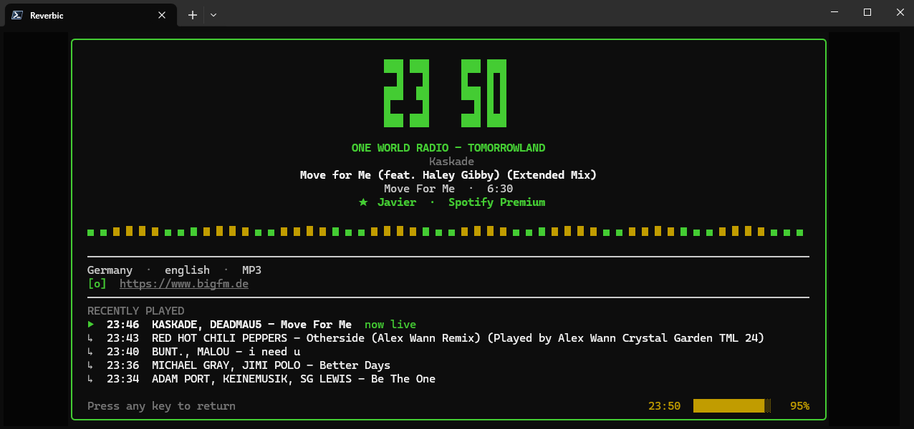

<p align="center">
  
</p>

<p align="center">Reproductor de radio en terminal y control remoto de Spotify para Windows.</p>

<p align="center">
  
  
  
  
</p>

<p align="center">
  <a href="README.md">English</a> |
  <a href="README.es.md">Español</a>
</p>

[](https://github.com/sewandev/Reverbic)

---

## Funcionalidades

**Radio**
- Busca estaciones de radio por nombre, género o país via [radio-browser.info](https://www.radio-browser.info)
- Lista de estaciones curada con metadatos enriquecidos (codec, bitrate, etiquetas, web oficial)
- Favoritas con soporte de renombrado
- Historial de canciones recientes
- Crossfade entre estaciones (1–10 s)
- Guardar canciones en una lista local
- Catálogo de programas on-demand

**Spotify**
- Control remoto: buscar, reproducir, pausar, seek, volumen
- Transferencia de dispositivos (se requiere cuenta Premium para reproducir)
- Sub-pestañas: Búsqueda y Dispositivos
- Manejo de rate-limit con cuenta regresiva

**Windows**
- Overlay flotante — siempre encima, posición configurable (4 esquinas) y transparencia ajustable
- Icono en la bandeja del sistema con notificaciones balloon
- Soporte de teclas de medios (Play/Pause, Stop)
- Audio ducking — reduce el volumen automáticamente cuando otra aplicación produce audio
- Detección de juegos — el overlay cambia a modo de información del juego

**UI / UX**
- Protector de pantalla con reloj, información de la estación y metadatos de la canción
- Soporte completo de ratón (clic, scroll, doble clic)
- Búsqueda fuzzy en la lista de estaciones y el modal
- Navegación orientada al teclado
- i18n: inglés / español

---

## Atajos de teclado

### Lista de estaciones

| Tecla | Acción |
|-------|--------|
| `↑` / `k`, `↓` / `j` | Navegar |
| `Enter` | Reproducir estación |
| `Space` | Pausar / Reanudar |
| `+` / `=`, `-` | Subir / bajar volumen |
| `F` | Agregar a favoritas |
| `e` | Renombrar estación |
| `r` | Estación aleatoria |
| `s` | Guardar canción actual |
| `/` | Búsqueda rápida |
| `→` | Enfocar canciones recientes |
| `Tab` | Abrir modal de búsqueda |
| `Alt+O` | Abrir configuración |
| `q` | Salir |

### Modal de búsqueda

| Tecla | Acción |
|-------|--------|
| `↑↓` | Navegar resultados |
| `Enter` | Reproducir / Confirmar |
| `F` | Guardar en favoritas |
| `R` | Resultado aleatorio |
| `Alt+G` | Buscar por género |
| `Alt+C` | Buscar por país |
| `Tab` | Cambiar a pestaña Spotify |
| `?` | Panel de ayuda |
| `Esc` | Volver / Cerrar |

### Pestaña Spotify

| Tecla | Acción |
|-------|--------|
| `←` / `→` | Cambiar sub-pestaña (Búsqueda / Dispositivos) |
| `Enter` | Reproducir canción / Transferir a dispositivo |
| `Space` | Pausar / Reanudar |
| `Alt+D` | Desconectar |
| `Alt+R` | Recargar dispositivos |

---

## Instalación

### Requisitos

- Windows 10 u 11
- [Rust](https://rustup.rs/) (última versión estable)
- Cuenta de Spotify Premium (para las funciones de Spotify)

### Compilar desde el código fuente

```powershell
git clone https://github.com/sewandev/Reverbic.git
cd Reverbic
cargo build --release
.\target\release\reverbic.exe
```

---

## Configuración

Todos los ajustes son accesibles desde la aplicación con `Alt+O`. No es necesario editar ningún archivo de configuración.

| Ajuste | Descripción |
|--------|-------------|
| Autoplay última estación | Reanuda la última estación al iniciar |
| Crossfade | Duración del fundido entre estaciones |
| Modo overlay | Oculto / Al reproducir / Siempre / Solo en juegos |
| Posición del overlay | Arriba-izquierda / Arriba-derecha / Abajo-izquierda / Abajo-derecha |
| Transparencia del overlay | 0–100 % |
| Audio ducking | Reduce el volumen automáticamente cuando otra app reproduce audio |
| Volumen duck | Nivel de volumen objetivo al activar el ducking |
| Teclas de medios | Activar soporte de teclas multimedia |
| Bandeja del sistema | Mostrar icono con notificaciones |
| Protector de pantalla | Tiempo de inactividad antes de activar el protector |
| Paso de volumen | Cambio de volumen por tecla |
| Pre-buffer | Segundos de buffer antes de iniciar la reproducción |
| Idioma | Inglés / Español |

La configuración se guarda en `%APPDATA%\reverbic\config.json`.

---

## Autor

**Esteban Jaramillo** — Chile  
[github.com/sewandev/Reverbic](https://github.com/sewandev/Reverbic)
