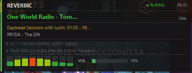

<p align="center">
  
</p>

<p align="center">Reproductor de radio en terminal y control remoto de Spotify para Windows.</p>

<p align="center">
  
  
  
  
</p>

<p align="center">
  <a href="README.md">English</a> |
  <a href="README.es.md">Español</a>
</p>

<p align="center">
  <a href="CHANGELOG.md">Changelog</a> |
  <a href="CHANGELOG.es.md">Registro de cambios</a>
</p>

<p align="center">
  
</p>

<p align="center">
  
  <br><em>Overlay para juegos</em>
</p>

---

## Funcionalidades

**Radio**
- Busca estaciones de radio por nombre, género o país via [radio-browser.info](https://www.radio-browser.info)
- Lista de estaciones curada con metadatos enriquecidos (codec, bitrate, etiquetas, web oficial)
- Favoritas con soporte de renombrado
- Historial de canciones recientes
- Crossfade entre estaciones (1–10 s)
- Guardar canciones en una lista local
- Catálogo de programas on-demand

**Spotify**
- Control remoto: buscar, reproducir, pausar, seek, volumen
- Transferencia de dispositivos (se requiere cuenta Premium para reproducir)
- Sub-pestañas: Búsqueda y Dispositivos
- Manejo de rate-limit con cuenta regresiva

**Windows**
- Overlay flotante — siempre encima, posición configurable (4 esquinas) y transparencia ajustable
- Icono en la bandeja del sistema con notificaciones balloon
- Soporte de teclas de medios (Play/Pause, Stop)
- Audio ducking — reduce el volumen automáticamente cuando otra aplicación produce audio
- Detección de juegos — el overlay cambia a modo de información del juego

**UI / UX**
- Protector de pantalla con reloj, información de la estación y metadatos de la canción
- Soporte completo de ratón (clic, scroll, doble clic)
- Búsqueda fuzzy en la lista de estaciones y el modal
- Navegación orientada al teclado
- i18n: inglés / español

---

## Por que una app de terminal?

| | Reverbic | Navegador + radio web |
|---|---|---|
| Uso de RAM | ~25 MB | 300–600 MB |
| CPU en reposo | < 1 % | 3–8 % |
| Tiempo de inicio | < 1 s | 3–8 s |
| Espacio en disco | ~8 MB | 500 MB+ |
| Corre en segundo plano | La terminal debe quedar abierta | Necesita una ventana abierta |
| Teclas multimedia | Soporte nativo | Depende del sitio |
| Audio ducking | Integrado | No disponible |
| Publicidad / rastreo | Ninguno | Presente en la mayoria de sitios |
| Protector de pantalla / overlay | Si | No disponible |
| Configuracion local | JSON local | Cuenta / cookies |

---

## Instalación

### Requisitos

- Windows 10 u 11
- [Rust](https://rustup.rs/) (última versión estable)

### Descarga

Los binarios precompilados están disponibles en la [página de Releases](https://github.com/sewandev/Reverbic/releases/latest).

Descarga `reverbic-v1.0.0-x86_64-windows.exe` y ejecútalo una vez desde cualquier terminal. En el primer arranque, el binario se copia automáticamente a `%LOCALAPPDATA%\Programs\reverbic\` y agrega esa carpeta al PATH del usuario. Luego abre una nueva terminal y escribe `reverbic` desde cualquier lugar.

> **Windows SmartScreen** puede mostrar una advertencia para binarios sin firma. Haz clic en "Más información" → "Ejecutar de todas formas".

### Compilar desde el código fuente

```powershell
git clone https://github.com/sewandev/Reverbic.git
cd Reverbic
cargo build --release
.\target\release\reverbic.exe
```

### Configuración de Spotify

La integración con Spotify requiere un client ID del [Spotify Developer Dashboard](https://developer.spotify.com/dashboard).

1. Crea una app en el dashboard
2. Agrega `http://localhost:8888/callback` como Redirect URI
3. Abre Reverbic, presiona `Alt+O` para abrir Ajustes, navega hasta **Spotify Client ID** y presiona `Espacio`
4. Pega tu Client ID y presiona `Enter` — no necesitas recompilar

> La reproducción de Spotify requiere una cuenta **Premium**. Las cuentas gratuitas pueden usar búsqueda y listado de dispositivos.

---

## Configuración

Todos los ajustes son accesibles desde la aplicación con `Alt+O`. No es necesario editar ningún archivo de configuración.

| Ajuste | Descripción |
|--------|-------------|
| Autoplay última estación | Reanuda la última estación al iniciar |
| Crossfade | Duración del fundido entre estaciones |
| Modo overlay | Oculto / Al reproducir / Siempre / Solo en juegos |
| Posición del overlay | Arriba-izquierda / Arriba-derecha / Abajo-izquierda / Abajo-derecha |
| Transparencia del overlay | 0–100 % |
| Audio ducking | Reduce el volumen automáticamente cuando otra app reproduce audio |
| Volumen duck | Nivel de volumen objetivo al activar el ducking |
| Teclas de medios | Activar soporte de teclas multimedia |
| Bandeja del sistema | Mostrar icono con notificaciones |
| Protector de pantalla | Tiempo de inactividad antes de activar el protector |
| Paso de volumen | Cambio de volumen por tecla |
| Pre-buffer | Segundos de buffer antes de iniciar la reproducción |
| Idioma | Inglés / Español |

La configuración se guarda en `%APPDATA%\reverbic\config.json`.

---

## Construido con

**Fuentes de datos**
| Fuente | Uso |
|--------|-----|
| [radio-browser.info](https://www.radio-browser.info) | Búsqueda de estaciones por nombre, género y país |
| [Spotify Web API](https://developer.spotify.com/documentation/web-api) | Búsqueda de canciones, control de reproducción, dispositivos |
| [Deezer API](https://developers.deezer.com) | Enriquecimiento de metadatos (artista, álbum, portada) |
| [iTunes Search API](https://developer.apple.com/library/archive/documentation/AudioVideo/Conceptual/iTuneSearchAPI) | Metadatos de canciones como respaldo |

**Librerías principales**
| Crate | Propósito |
|-------|-----------|
| [ratatui](https://github.com/ratatui-org/ratatui) | Framework de UI en terminal |
| [librespot](https://github.com/librespot-org/librespot) | Streaming de audio Spotify (Premium) |
| [rodio](https://github.com/RustAudio/rodio) | Motor de reproducción de audio |
| [tokio](https://tokio.rs) | Runtime asíncrono |
| [crossterm](https://github.com/crossterm-rs/crossterm) | Entrada/salida de terminal multiplataforma |
| [serde](https://serde.rs) | Serialización de configuración |

