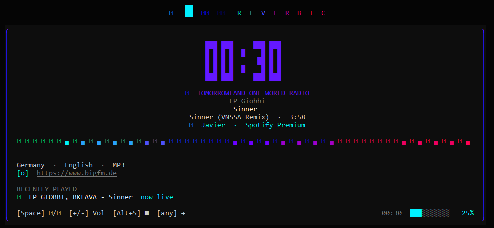
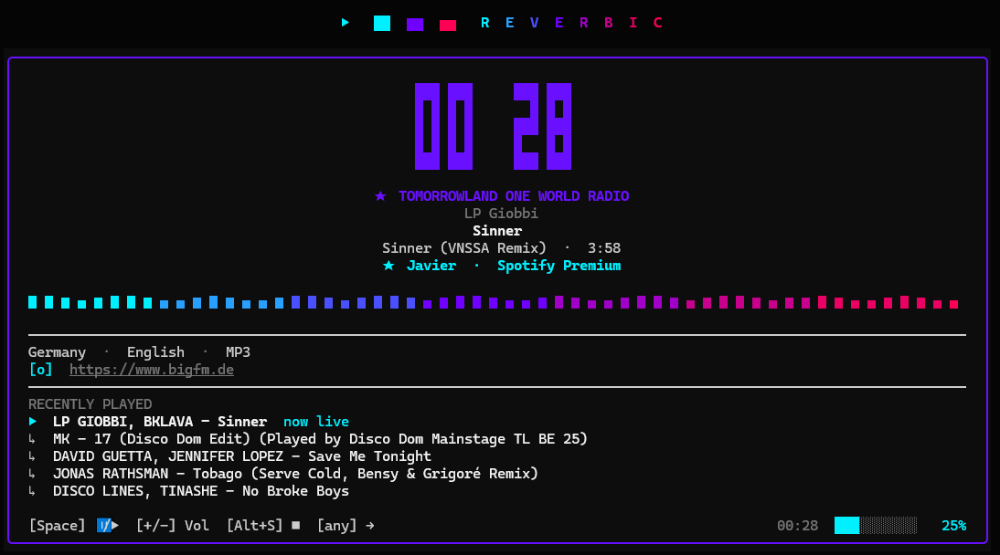

<p align="center">
  
</p>

<p align="center">Terminal radio player &amp; Spotify remote for Windows, macOS, and Linux.</p>

<p align="center">
  
  
  
  
</p>

<p align="center">
  <a href="README.md">English</a> |
  <a href="README.es.md">Español</a>
</p>

<p align="center">
  <a href="CHANGELOG.md">Changelog</a> |
  <a href="CHANGELOG.es.md">Changelog ES</a>
</p>

<p align="center">
  
</p>

---

## Features

**Radio**
- Search internet radio stations by name, genre, or country via [radio-browser.info](https://www.radio-browser.info)
- Curated station list with rich metadata (codec, bitrate, tags, homepage)
- Favorites with rename support
- Recent tracks history
- Crossfade between stations (1–3 s)
- Save tracks to a local list
- On-demand show catalog

**Spotify**
- Remote control: search, play, pause, seek, volume
- Device transfer (Premium required for playback)
- Sub-tabs: Search and Devices
- Rate-limit handling with countdown

**Windows / Desktop**
- Floating overlay — always on top, configurable position (4 corners) and transparency
- System tray icon with balloon notifications
- Media key support (Play/Pause, Stop)
- Audio ducking — auto-reduces volume when another app produces sound
- Game detection — switches overlay to game-info mode
- Discord Rich Presence — shows current station and track on your Discord profile

**UI / UX**
- Screensaver mode with clock, station info, and track metadata
- Full mouse support (click, scroll, double-click)
- Fuzzy search in station list and modal
- Keyboard-first navigation
- i18n: English / Spanish

---

## Screenshots

<table align="center">
  <tr>
    <td align="center">
      <br>
      <sub>Gaming overlay</sub>
    </td>
    <td align="center">
      <br>
      <sub>Discord Rich Presence</sub>
    </td>
  </tr>
</table>

---

## Why a terminal app?

| | Reverbic | Browser + web radio |
|---|---|---|
| RAM usage | ~25 MB | 300–600 MB |
| CPU at idle | < 1 % | 3–8 % |
| Startup time | < 1 s | 3–8 s |
| Disk footprint | ~8 MB | 500 MB+ |
| Runs in background | Terminal window must stay open | Needs a window open |
| Media keys | Native support | Depends on the site |
| Audio ducking | Built-in | Not available |
| Ads / tracking | None | Present on most sites |
| Screensaver / overlay | Yes | Not available |
| Offline config | Local JSON | Account / cookies |

---

## Installation

### Requirements

- Windows 10/11, macOS, or Linux
- [Rust](https://rustup.rs/) (latest stable)

> [!IMPORTANT]
> **Recommended terminal:** [Windows Terminal](https://aka.ms/terminal) with PowerShell 7+. Reverbic works in CMD but some icons, animations, and Unicode characters may not render correctly. Windows Terminal provides the best visual experience.

<table>
  <tr>
    <td align="center">
      <a href="https://apps.microsoft.com/detail/9n0dx20hk701?hl"></a><br>
      <sub>Terminal Windows</sub>
    </td>
    <td align="center">
      <a href="https://apps.microsoft.com/detail/9mz1snwt0n5d?hl"></a><br>
      <sub>Powershell 7</sub>
    </td>
  </tr>
</table>

<details>
  <summary>Classic CMD vs Modern Terminal + Powershell 7</summary>

  <table>
  <tr>
    <td align="center">
      <br>
      <sub>Classic CMD</sub>
    </td>
    <td align="center">
      <br>
      <sub>Modern Terminal + Powershell 7</sub>
    </td>
  </tr>
</table>
</details>

### Download

**Quick Install Script (PowerShell)**
```powershell
irm https://raw.githubusercontent.com/sewandev/Reverbic/main/install.ps1 | iex
```

**Via Scoop**
```powershell
scoop bucket add reverbic https://github.com/sewandev/scoop-reverbic
scoop install reverbic
```

**Direct Download**
Pre-built binaries are available on the [Releases page](https://github.com/sewandev/Reverbic/releases/latest).

Download the `.exe` file from the releases page and run it once from any terminal. On first launch, it automatically copies itself to `%LOCALAPPDATA%\Programs\reverbic\` and adds that folder to your user PATH. After that, open a new terminal and type `reverbic` from anywhere.

> **Windows SmartScreen** may show a warning for unsigned binaries. Click "More info" → "Run anyway".

### Build from source

```powershell
git clone https://github.com/sewandev/Reverbic.git
cd Reverbic
cargo build --release
.\target\release\reverbic.exe
```

### Spotify setup

Spotify integration requires a client ID from the [Spotify Developer Dashboard](https://developer.spotify.com/dashboard).

1. Create an app in the dashboard
2. Add `http://localhost:8888/callback` as a Redirect URI
3. Open Reverbic, press `Alt+O` to open Settings, navigate to **Spotify Client ID** and press `Space`
4. Paste your Client ID and press `Enter` — no recompile needed

> Spotify playback requires a **Premium** account. Free accounts can use search and device listing only.

---

## Configuration

All settings are accessible inside the app via `Alt+O`. No config file editing required.

| Setting | Description |
|---------|-------------|
| Autoplay last station | Resume the last station on startup |
| Restore volume | Restore the volume level from the previous session |
| Crossfade | Crossfade duration between stations |
| Volume step | Volume change per keypress |
| Pre-buffer | Seconds to buffer before on-demand playback |
| Overlay mode | Hidden / When playing / Always / Games only |
| Overlay transparency | 0–100 % |
| Overlay position | Top-left / Top-right / Bottom-left / Bottom-right |
| Screensaver | Idle time before screensaver activates |
| Screensaver clock | Show the large digital clock in the screensaver |
| Audio ducking | Auto-reduce volume when other apps play audio |
| Duck volume | Target volume level when ducking |
| Media keys | Enable media key support |
| System tray | Show tray icon in the system tray |
| Notifications | Send system notifications when the track changes |
| Auto-update | Automatically download and apply updates |
| Discord Rich Presence | Show current station and track on Discord profile |
| Language | English / Spanish |
| Spotify: stop on quit | Stop Spotify playback when closing Reverbic |
| Spotify: go to Spotify on connect | Switch to the Spotify tab automatically on connect |
| Spotify: Client ID | Your Spotify app Client ID (press Space to edit) |

Config is stored at `~/.reverbic/config.json`.

---

## Built with

**Data sources**
| Source | Used for |
|--------|----------|
| [radio-browser.info](https://www.radio-browser.info) | Station search by name, genre and country |
| [Spotify Web API](https://developer.spotify.com/documentation/web-api) | Track search, playback control, device listing |
| [Deezer API](https://developers.deezer.com) | Track metadata enrichment (artist, album, artwork) |
| [iTunes Search API](https://developer.apple.com/library/archive/documentation/AudioVideo/Conceptual/iTuneSearchAPI) | Fallback track metadata |

**Key libraries**
| Crate | Purpose |
|-------|---------|
| [ratatui](https://github.com/ratatui-org/ratatui) | Terminal UI framework |
| [librespot](https://github.com/librespot-org/librespot) | Spotify audio streaming (Premium) |
| [rodio](https://github.com/RustAudio/rodio) | Audio playback engine |
| [tokio](https://tokio.rs) | Async runtime |
| [crossterm](https://github.com/crossterm-rs/crossterm) | Cross-platform terminal input/output |
| [serde](https://serde.rs) | Config serialization |

---

## Contributors

<a href="https://github.com/sewandev/Reverbic/graphs/contributors">
  
</a>
