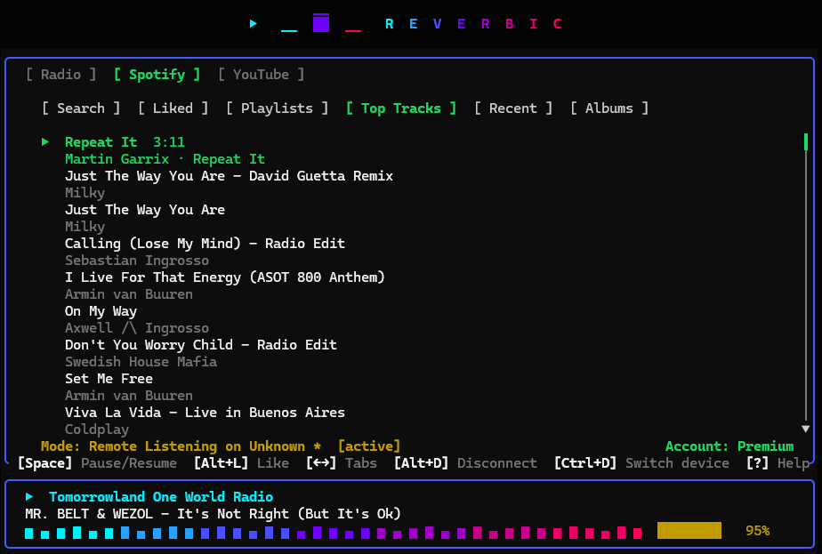
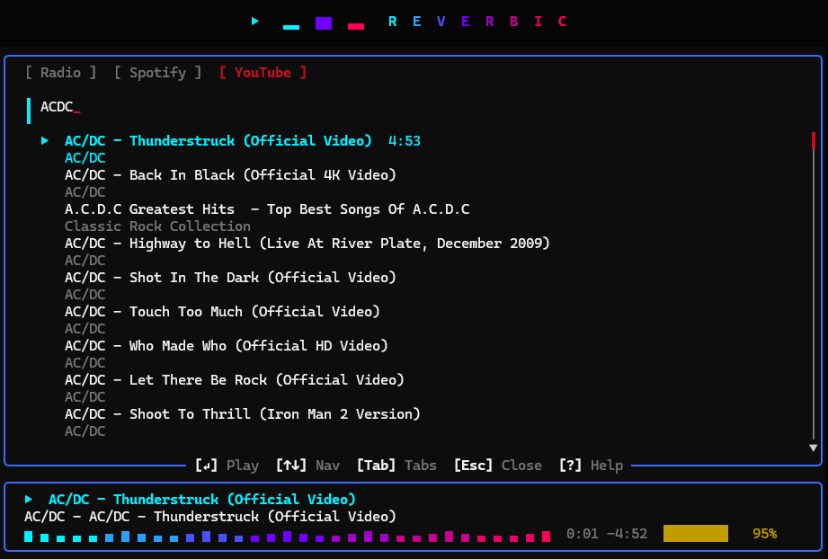
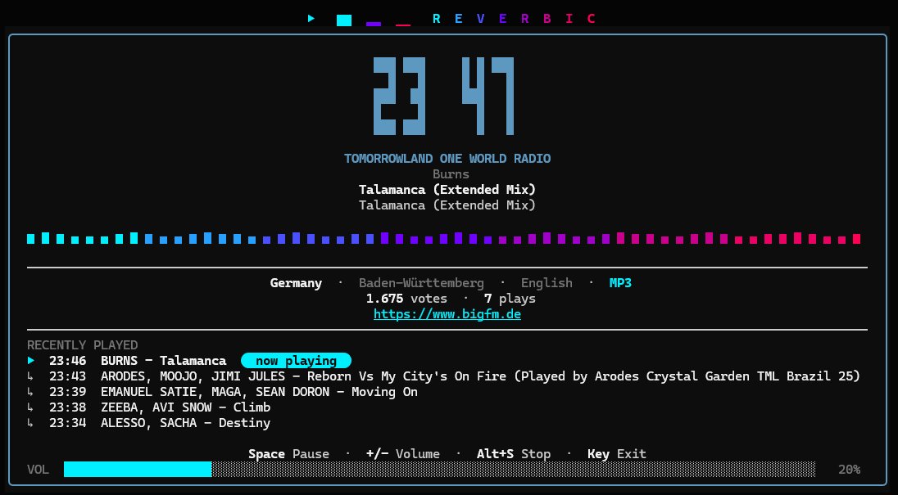
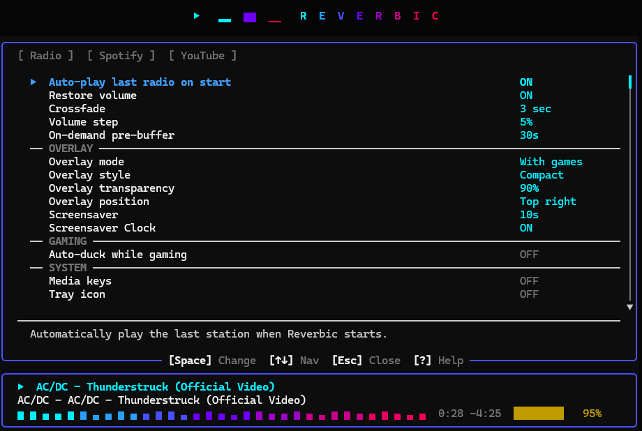

<p align="center">
  
</p>

<p align="center">All-in-one terminal player — Radio, Spotify &amp; YouTube, for Windows, macOS and Linux.</p>

<p align="center">
  <a href="https://github.com/sewandev/Reverbic/actions/workflows/ci.yml"></a>
  <a href="https://github.com/sewandev/Reverbic/actions/workflows/codeql.yml"></a>
  
  
  
  
</p>

<p align="center">
  <a href="README.md">English</a> |
  <a href="README.es.md">Español</a>
</p>

<p align="center">
  
</p>

---

## Installation

```bash
# Quick install (Windows)
irm https://raw.githubusercontent.com/sewandev/Reverbic/main/install.ps1 | iex

# Quick install (macOS / Linux)
brew install sewandev/reverbic/reverbic

# Package managers
scoop bucket add reverbic https://github.com/sewandev/scoop-reverbic; scoop install reverbic   # Windows (Scoop)
cargo install --git https://github.com/sewandev/Reverbic.git --locked                          # Any OS (Rust)

# Build from source
git clone https://github.com/sewandev/Reverbic.git
cd Reverbic
cargo build --release
./target/release/reverbic
```

> [!TIP]
> Recommended: run Reverbic in [Windows Terminal](https://apps.microsoft.com/detail/9n0dx20hk701?hl) with [PowerShell 7+](https://apps.microsoft.com/detail/9mz1snwt0n5d?hl) for the best visual experience.

> [!WARNING]
> **Windows SmartScreen** may show a warning for unsigned binaries. Click "More info" → "Run anyway".

---

## Features

- **Radio** — Search and play thousands of internet radio stations by name, genre, or country
- **Spotify** — Remote control: search, play, pause, seek, volume, and device transfer (Premium required)
- **YouTube** — Search and stream audio directly from YouTube
- **Lightweight** — ~25 MB RAM and < 1% CPU at idle, starts in under a second
- **Floating overlay** — always on top, with automatic game detection
- **Discord Rich Presence** — shows your current station and track on your profile
- **Favorites & crossfade** — save your favorite stations with smooth crossfade between them
- **Screensaver mode** — clock, station info, and track metadata when idle

> [!NOTE]
> Spotify's 2026 policy changes could restrict native playback (librespot) at any time. Remote Control mode (search and playback control via the official Spotify API) does not depend on librespot and is a reasonable fallback for that risk, though it has its own requirements (your own Spotify Premium account and Developer app). See [LEGAL.md](LEGAL.md) for details.

---

## Documentation

- **[Spotify guide](docs/spotify.md)** — playback modes, Client ID setup, shortcuts, and known limitations
- **[YouTube guide](docs/youtube.md)** — features (Mix, chapters, SponsorBlock), cookies setup, and known limitations
- **[Legal notes](LEGAL.md)** — third-party services, terms of service, and risk disclosures

> [!WARNING]
> If you configure YouTube cookies, **use a secondary ("burner") account** — never your main Google account. Full instructions in the [YouTube guide](docs/youtube.md).

---

## Screenshots

<table align="center">
  <tr>
    <td align="center">
      <br>
      <sub>Spotify remote control</sub>
    </td>
    <td align="center">
      <br>
      <sub>YouTube search</sub>
    </td>
    <td align="center">
      <br>
      <sub>Gaming overlay</sub>
    </td>
  </tr>
  <tr>
    <td align="center">
      <br>
      <sub>Screensaver mode</sub>
    </td>
    <td align="center">
      <br>
      <sub>Settings</sub>
    </td>
    <td align="center">
      <br>
      <sub>Discord Rich Presence</sub>
    </td>
  </tr>
</table>

---

## Changelog

See [CHANGELOG.md](CHANGELOG.md) for release notes and version history. ([Español](CHANGELOG.es.md))

---

## Contributors

<a href="https://github.com/sewandev/Reverbic/graphs/contributors">
  
</a>
