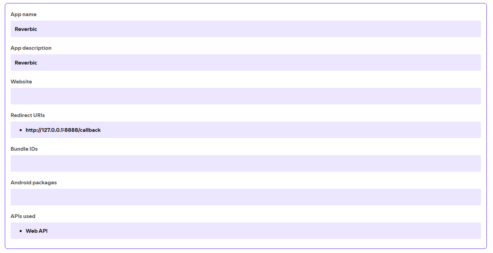
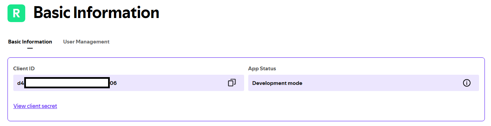

# Guía de Spotify

> [English](spotify.md) | Notas legales: [LEGAL.md](../LEGAL.md) (en inglés)

Reverbic integra Spotify de dos formas complementarias:

- **Control Remoto** — búsqueda, play/pausa, seek, volumen y transferencia de dispositivo a través de la [Spotify Web API](https://developer.spotify.com/documentation/web-api) oficial. El audio suena en otro cliente de Spotify (escritorio, móvil, web); Reverbic actúa como control remoto.
- **Reproducción nativa** — el audio suena dentro del propio Reverbic mediante [librespot](https://github.com/librespot-org/librespot), una biblioteca open-source de Spotify Connect.

El ajuste *Modo de reproducción* elige entre **Auto** (nativa cuando es posible, remota si no), **Remote** o **Native**. **Se requiere Spotify Premium** en ambos casos.

## Configuración

Cada usuario registra su propia aplicación de Spotify (ver [LEGAL.md](../LEGAL.md)); la cuenta dueña de la app necesita Premium.

1. Inicia sesión en el [Spotify Developer Dashboard](https://developer.spotify.com/dashboard) y haz clic en **Create app**.
2. Completa **App name** y **App description** con lo que quieras (ej. "Reverbic").
3. En **Redirect URIs**, agrega exactamente:
   ```
   http://127.0.0.1:8888/callback
   ```
4. En **Which API/SDKs are you planning to use?**, marca **Web API**, acepta los Developer Terms y haz clic en **Save**. La configuración de la app debería quedar así:

   

5. En la página de la app, abre **Settings** → **Basic Information** y copia el **Client ID**:

   
6. En Reverbic, abre Ajustes, pégalo en **Spotify Client ID** y conéctate desde la pestaña de Spotify — se abrirá tu navegador para autorizar la app.

La app queda en el *Development Mode* de Spotify, suficiente para uso personal. La autenticación usa el flujo oficial OAuth PKCE; el refresh token se guarda en el llavero del sistema operativo, nunca en texto plano.

## Atajos útiles

| Tecla | Acción |
| --- | --- |
| `↵` / `Space` | Reproducir / pausar-reanudar |
| `Alt+L` | Dar Me gusta a la pista actual |
| `Ctrl+D` | Cambiar dispositivo de reproducción (modo Remoto) |
| `←→` | Cambiar sub-pestañas (búsqueda, me gusta, playlists) |
| `Alt+D` | Desconectar la sesión de Spotify |

## Riesgos y limitaciones (fuera del control de Reverbic)

- **Cambios de política 2026**: la aplicación de DRM Widevine y el acceso más estricto a la API de Spotify apuntan a clientes no oficiales de Spotify Connect como librespot. La reproducción nativa podría bloquearse o degradarse en cualquier momento, con posibles restricciones temporales sobre la cuenta que la use. **El modo de Control Remoto no depende de librespot** y es el respaldo razonable. Detalles en [LEGAL.md](../LEGAL.md).
- **Cuotas de Developer Mode**: la app de Web API que registras está sujeta a los términos de Developer Mode de Spotify (incluido el requisito de Premium para el dueño de la app), que pueden cambiar sin aviso.

## Problemas comunes

- **"No hay dispositivo activo" en modo Remoto** — Spotify necesita al menos un cliente abierto (escritorio, móvil, web) para recibir comandos. Abre uno y usa `Ctrl+D` para seleccionarlo.
- **La reproducción deja de funcionar tras mucho tiempo** — el token de sesión expiró o fue revocado; desconecta (`Alt+D`) y vuelve a conectarte desde la pestaña de Spotify.
- **La reproducción nativa falla pero la remota funciona** — suele ser una restricción del lado de librespot (ver riesgos arriba); cambia el *Modo de reproducción* a **Remote**.
