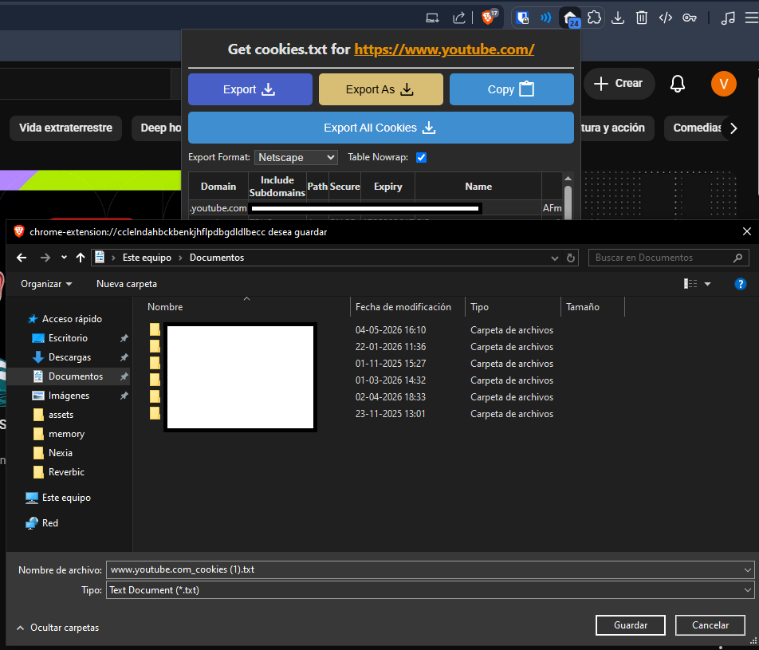

# YouTube Guide

> [Español](youtube.es.md) | Legal notes: [LEGAL.md](../LEGAL.md)

Reverbic streams YouTube audio through [yt-dlp](https://github.com/yt-dlp/yt-dlp), using the [Deno](https://deno.com/) runtime to solve YouTube's JavaScript signature challenges. Both binaries are downloaded automatically from their official GitHub releases, verified by SHA256 checksum, and **yt-dlp keeps itself up to date** (daily check) — YouTube changes its anti-bot measures constantly, and an outdated yt-dlp is the most common cause of playback breakage.

## Features

| Feature | How to use it |
| --- | --- |
| Search and play | Type in the YouTube tab, `↵` to play |
| Liked videos & playlists | `←→` sub-tabs (requires cookies, see below) |
| Continuous playback | When a track ends, the next one in the list plays automatically |
| Mix (infinite radio) | `Ctrl+R` on any video starts an auto-extending queue of similar songs |
| Chapters | In long videos, the current chapter shows next to the title; `[` and `]` jump between chapters |
| Crossfade | Settings → *YouTube Crossfade* blends the end of each track into the next |
| SponsorBlock | Settings → *SponsorBlock (YouTube)* skips non-music sections. Off by default; when enabled, the video ID is sent to the community [SponsorBlock API](https://sponsor.ajay.app/) |
| Precise seeking | Tracks download to a temporary file at full speed, so seeking is instant and playback survives network drops |

## How caching works

- **Resolved URLs** are cached for **4 hours** in `youtube_url_cache.json` inside the cache directory (`~/.cache/reverbic/`, or `%LOCALAPPDATA%\Reverbic\cache\` on Windows), so replaying a recent video starts almost instantly — even after restarting Reverbic. The 4-hour limit comes from YouTube: its stream URLs self-expire after ~6 hours, so caching longer is not possible.
- Only **anonymous** resolutions are persisted. Anything resolved with your cookies stays in memory and never touches disk.
- URLs are **tied to your IP**: if you switch networks or enable a VPN, a cached URL may stop working — Reverbic detects this, discards it, and re-resolves automatically on the next play.
- The **downloaded audio** (`youtube/*.m4a` inside the cache directory) is temporary: it is wiped every time Reverbic starts, so no YouTube media accumulates on disk.

## Cookies setup (optional)

Some videos require signing in (age-restricted, region-locked, or members-only content). Reverbic can use a `cookies.txt` file to access them.

> [!WARNING]
> **Use a secondary ("burner") account** — never your main Google account. The cookies file grants access to that account's YouTube session, and yt-dlp may rewrite the file as cookies rotate.

1. Install [Get cookies.txt LOCALLY](https://github.com/kairi003/Get-cookies.txt-LOCALLY) (Chrome, Edge, or Firefox), an open-source extension that never sends your cookies anywhere. To use it in a private window you must allow it explicitly: in your browser's extension settings, enable **Allow in Incognito** (Chrome) / **Allow in InPrivate** (Edge) / **Run in Private Windows** (Firefox).
2. Open a **private/incognito window** and sign in to YouTube with your secondary account.
3. While on **youtube.com**, click the extension's icon and press **Export** — it downloads a `cookies.txt` in Netscape format for the current site. Save it somewhere private.

   
4. Close the private window **without signing out** (signing out invalidates the exported cookies).
5. In Reverbic, open Settings and set **YouTube Cookies File** to the saved file's path.
6. Use **Validate YouTube session** in Settings at any time to check that the cookies still work.

File hygiene: on Linux/macOS run `chmod 600 cookies.txt`; on Windows, avoid cloud-synced folders (OneDrive, Dropbox, etc.).

Privacy: Reverbic only passes the file path to yt-dlp — cookies are never transmitted elsewhere, and session data is never written to Reverbic's caches or logs. Public videos are always resolved **without** cookies; the session is only used as a fallback for videos that require it.

## Known limitations (outside Reverbic's control)

- **"Sign in to confirm you're not a bot"** — YouTube's anti-bot system (PO Tokens) can block stream access regardless of cookies. It usually resolves itself within hours; yt-dlp updates also help, and Reverbic installs them automatically.
- **A restricted video plays for a second and skips** — videos that require cookies only get YouTube's combined web format, whose HE-AAC audio variant the audio decoder cannot play yet. Reverbic detects the failure and moves on to the next track instead of hanging.
- **HTTP 403 on a recently played video** — stream URLs expire after ~6 hours and are tied to your IP. Reverbic discards the dead URL automatically; just play the video again.
- **A video is unavailable in Mix or search** — region blocks, deleted videos, and "made for kids" restrictions come straight from YouTube.

## Diagnostics

Reverbic logs every resolution and playback event:

```powershell
Get-Content "$env:LOCALAPPDATA\Reverbic\cache\logs\reverbic.log" | Select-String "yt-dlp|youtube:|track finished|ended early"
```

A healthy resolution logs `resolved YouTube audio format` with `format_id=140` (audio-only AAC). If you open an issue, include the relevant log lines.
